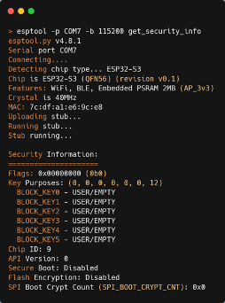
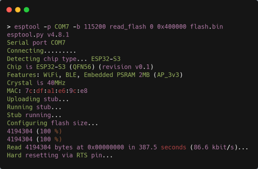
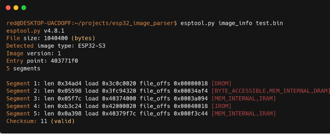
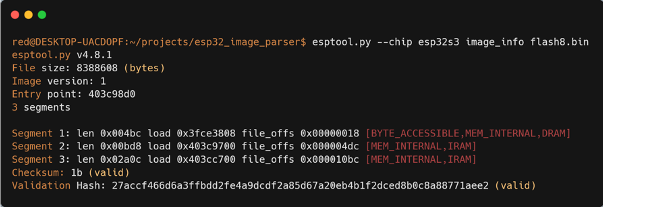
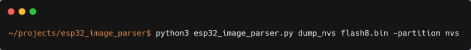
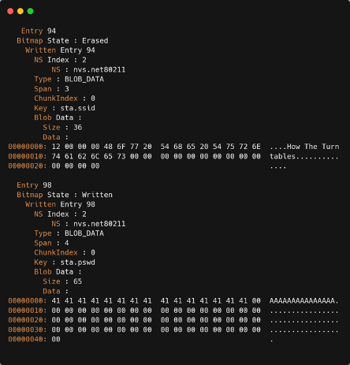
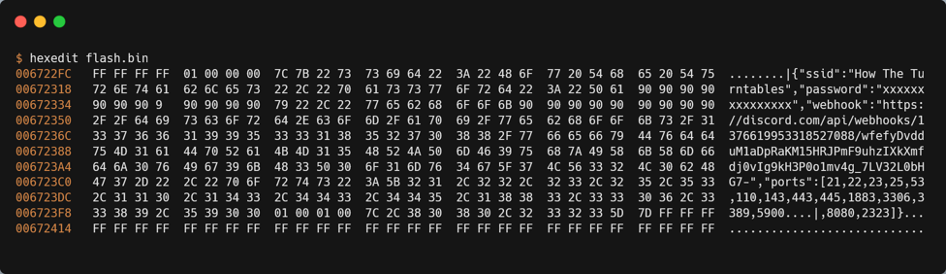
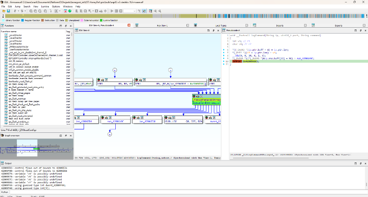

<div align="center">

## ESP32 IoT-Honeypot
  
This project is a standalone Multi-port honeypot for ESP32 platform based on the GitHub project <a href="https://github.com/7h30th3r0n3/NanoC6-ESP32-Honeypot">NanoC6-ESP32-Honeypot</a> from @7h30th3r0n3. It emulates a realistic Linux shell environment on telnet and multiple port banner to attract and analyze unauthorized access attempts. It features a full web-based configuration UI, persistent storage using SPIFFS, and webhook-based alerting that has been integrated with Discord and an ELK-Stack has been set up.
  
<table>
  <tr>
    <td align="center">
      <strong>Web Interface (WebUI)</strong><br>
      
    </td>
    <td align="center">
      <strong>What an Attacker Sees (Nmap Scan)</strong><br>
      
    </td>
  </tr>
  <tr>
    <td align="center">
      <strong>Real-time Alerts on Discord</strong><br>
      
    </td>
  </tr>
</table>

</div>

---

## ✅ Features

- Interactive Telnet honeypot server on port 23
- Interactive RouterOS honeypot server on port 2323
- Fake file system structure with secrets to lure attackers
- Realistic Linux shell simulation with multiple commands supported (pwd, whoami, cat, ls, cd, apt, etc.)  
- Banner grabbing for port 21,22,25,53,110,143,443,445,3306,3389,5900,8080  
- Automatic logging of all client inputs with NTP-synchronized timestamp and IP address
- Webhooks for real-time alerts (Discord, SIEM (ELK))
- Web-based configuration panel (SSID, password, port selection and webhook configuration)
- SPIFFS-based file system for persistent config and logs on flash
- Modular code, compatible with any ESP32 board

---
## 🧩 Compatible Devices

Tested and confirmed working on:
- **ESP32-S3-DevKitC-1**

---

## ⚙️ Installation

1. Flash this firmware on any ESP32 using Arduino IDE or PlatformIO
2. On first boot, ESP32 will create a Wi-Fi access point:
   - SSID: HoneypotConfig
   - Password: HoneyPotConfig123
3. Connect and open `http://192.168.4.1` to configure
4. After saving the configuration, the ESP32 will reboot and connect to your Wi-Fi
5. Telnet honeypot starts on port 23, listening for attackers
6. All captured inputs will be logged and optionally sent to your webhook

If the AP is not near it, mode configuration is enabled and web portal is accessible.

--- 

## 🌳 LED Behavior Decision Tree for NanoC6

```
                        🔵 Device Boot
                              │
                              v
                    ⚪ LED: White (3 seconds)
                              │
                              v
                   Is Button A stay pressed?
                        /           \
                       /             \
                ⬅️ No                  Yes ➡️
           🌈 LED Rainbow        🔵 LED Blue (WebUI configuration Mode)
                  │
                  v
        Try connecting to Wi-Fi
                  │
                  v
         Wi-Fi connection success?
              /              \
             /                \
        ⬅️ No                   Yes ➡️
 🔵 LED Blue flashing ×3    🟩 LED Green (Honeypot Active)
      then fix blue               │
(WebUI configuration Mode)        |
                                  v
                       Incoming connection?
                             /        \
                            /          \
                       ⬅️ No             Yes ➡️
                    (Stay Green)   🔴 LED Red flashes ×2
                                          then Red fixed
```

---

## 📦 Dependencies

- ESPAsyncWebServer
- ArduinoJson
- SPIFFS (built-in)
- WiFi (built-in)
- FastLED

Make sure to install the required libraries via Library Manager or PlatformIO.

---

## 📁 SPIFFS Structure

/config.json       → Contains Wi-Fi and webhook settings  
/honeypot_logs.txt → Stores captured login attempts and commands  
/index.html        → Web-based configuration UI  

All files are automatically created at first boot if missing.

---

## 📡 Webhook Format

Example payload (JSON, sent as POST):

{
  "content": "📡 Honeypot\n🔍 IP: 192.168.1.5\n💻 Command: `cat /etc/passwd`"
}

You can route this to:

- Discord (via Webhook URL)
- Telegram (via Bot API Gateway)
- Signal (via relay server or bridge)
- WhatsApp (via Business API)
- SIEMs or custom log collectors

---

## 🧠 Emulated Commands

Basic commands:
- pwd, whoami, uptime, hostname, uname -a, id, lscpu, df -h, free -h, env, set, history

Filesystem:
- ls, ls -l, cd, cat, mkdir, rm, rmdir, touch, chmod, chown

Networking:
- ifconfig, ip addr, ping, netstat -an, curl, wget

Services:
- service <name> start/stop/status
- systemctl status/start/stop

Package manager:
- apt-get update, apt-get install

Privilege escalation:
- sudo (with denial)

Fake files like `/etc/passwd`, `secrets.txt`, `mysql_credentials.txt`, etc. are included to bait the attacker.

---

## 🛡️ Usage Notes

This honeypot is designed for educational and defensive cybersecurity purposes. Do not expose to the internet without proper upstream firewalling or network segmentation. It is not intended to replace full honeynet frameworks like Cowrie, but serves as a lightweight ESP32-based trap canary.

## Security of ESP32 flash dumps

The intention is to explore the potential vulnerabilities and protective measures associated with accessing and analyzing the flash memory of an ESP32 microcontroller. It aims to highlight the security implications of dumping flash data while having physical access to the embedded device, such as the risk of exposing sensitive information like Wi-Fi credentials, encryption keys, or proprietary code. 

### esptool.py 
**esptool.py** is an open-source, Python-based utility used for flashing and communicating with Espressif chips like the ESP32. It allows developers to perform tasks such as reading and writing flash memory, retrieving chip IDs and MAC addresses, and managing eFuse settings. One of its key features is the ability to dump flash memory using commands like `read_flash`, although this may be restricted by security features such as flash encryption and secure boot. Additionally, esptool offers a Python API, making it easy to integrate into custom scripts for automated flashing or provisioning workflows.

<strong>Output of ESPTool</strong><br>


### esptool.py dumping flash
The read_flash command in esptool is used to read and dump the contents of an ESP32's flash memory to a binary file. This is useful for backing up firmware, analyzing stored data, or inspecting potential security vulnerabilities, but may be limited by protections like flash encryption.

<strong>Output of ESPTool read-flash</strong><br>


### esptool image info
The `image_info` command in **esptool.py** prints detailed metadata about a `.bin` or `.hex` firmware image, including load addresses, segment sizes, flash mode, flash frequency, and flash chip size ([docs.espressif.com][1]). It can also detect ESP-IDF–based apps or bootloaders and display their specific headers when using the proper `--chip` option (e.g., `--chip esp32`) ([sming-slaff.readthedocs.io][2]). Developers use it for quick inspection and verification of firmware before flashing, making sure configuration parameters match the target device’s flash settings and preventing mismatches.

<strong>Output of ESPTool image_info using the compiled flash from PIO</strong><br>


<strong>Output of ESPTool image_info using the dumped flash from the ESP23</strong><br>


These images highlight the differences in the partition table of the binary flash file. The DROM segment is apparently missing in the flash dumped binary.

### Converting a flash dump to an ELF file
The tool 'esp32_image_parser' is used to construct a ELF files from a ESP32 flash dumps. This tool was presented at the Shmoocon 2020. 

Sadly, we could not get this tool to generate a ELF file, as it had problems converting the data using the included partition table. We tried to patch the python script with custom partition tables, overwrite the segment mapping, dumping the flash again with 8MB instead of 4MB and added support for the ESP32-C3 based embedded devices. 

Sources: 
- https://www.youtube.com/watch?v=w4_3vwN_2dI
- https://github.com/tenable/esp32_image_parser

### NVS - Non-volatile Storage Libary
The Non‑Volatile Storage (NVS) library on ESP32 provides a key–value pair storage system within a dedicated partition of the device's flash memory, supporting data types like integers, strings, and blobs. Although NVS supports optional encryption to protect stored values, physical access to the flash still allows erasure or rollback attacks, so it’s best used for small configuration data rather than robust tamper‑resistant storage. 

<strong>Command for extracting the NVS from a dumped flash</strong><br>


<strong>Secrets like SSID and WIFI-Password in NVS</strong><br>


Is is also possible to find these values via hexedit in the dumped flash, but this approach can be very time consuming and inefficient. 
<strong>Finding secrets in NVS of a dumped flash via hexedit</strong><br>


### Reverse Engineering using IDA 
By using two plugins for IDA Pro, it was possible to decompile the compiled flash by PIO: 
- https://github.com/themadinventor/ida-xtensa
- https://github.com/jrozner/esp-image-ida

<strong>Decompile the flash from PIO using IDA Pro</strong><br>



## 📄 License

MIT License - Use freely with attribution.
