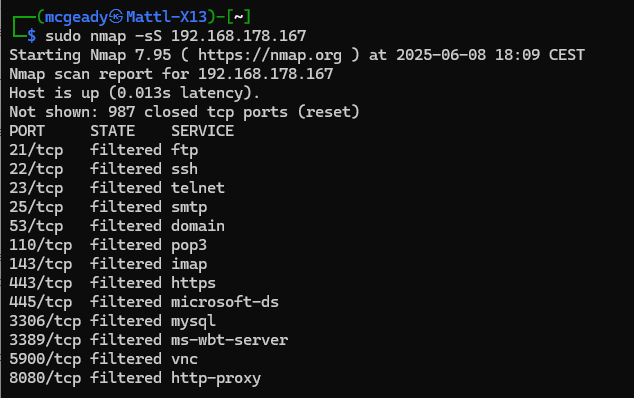

<div align="center">

## ESP32 IoT-Honeypot


  
This project is a standalone Multi-port honeypot for ESP32 platform based on the GitHub project <a href="https://github.com/7h30th3r0n3/NanoC6-ESP32-Honeypot">NanoC6-ESP32-Honeypot</a> from @7h30th3r0n3. It emulates a realistic Linux shell environment on telnet and multiple port banner to attract and analyze unauthorized access attempts. It features a full web-based configuration UI, persistent storage using SPIFFS, and webhook-based alerting that has been integrated with Discord and an ELK-Stack has been set up.
  
<table>
  <tr>
    <td align="center">
      <strong>Web Interface (WebUI)</strong><br>
      
    </td>
    <td align="center">
      <strong>What an Attacker Sees (Nmap Scan)</strong><br>
      
    </td>
  </tr>
  <tr>
    <td align="center">
      <strong>Real-time Alerts on Discord</strong><br>
      
    </td>
  </tr>
</table>

</div>

---

## ✅ Features

- Interactive Telnet honeypot server on port 23
- Fake file system structure with secrets to lure attackers
- Realistic Linux shell simulation with multiple commands supported (pwd, whoami, cat, ls, cd, apt, etc.)  
- Banner grabbing for port 21,22,25,53,110,143,443,445,3306,3389,5900,8080  
- Automatic logging of all client inputs with timestamp and IP address
- Webhooks for real-time alerts (Discord, SIEM (ELK))
- Web-based configuration panel (SSID, password, port selection and webhook configuration)
- SPIFFS-based file system for persistent config and logs
- Modular code, compatible with any ESP32 board

---
## 🧩 Compatible Devices

Tested and confirmed working on:
- **ESP32-S3-DevKitC-1**

---

## ⚙️ Installation

1. Flash this firmware on any ESP32 using Arduino IDE or PlatformIO
2. On first boot, ESP32 will create a Wi-Fi access point:
   - SSID: HoneypotConfig
   - Password: HoneyPotConfig123
3. Connect and open `http://192.168.4.1` to configure
4. After saving the configuration, the ESP32 will reboot and connect to your Wi-Fi
5. Telnet honeypot starts on port 23, listening for attackers
6. All captured inputs will be logged and optionally sent to your webhook

If the AP is not near it, mode configuration is enabled and web portal is accessible.

--- 

## 🌳 LED Behavior Decision Tree for NanoC6

```
                        🔵 Device Boot
                              │
                              v
                    ⚪ LED: White (3 seconds)
                              │
                              v
                   Is Button A stay pressed?
                        /           \
                       /             \
                ⬅️ No                  Yes ➡️
           🌈 LED Rainbow        🔵 LED Blue (WebUI configuration Mode)
                  │
                  v
        Try connecting to Wi-Fi
                  │
                  v
         Wi-Fi connection success?
              /              \
             /                \
        ⬅️ No                   Yes ➡️
 🔵 LED Blue flashing ×3    🟩 LED Green (Honeypot Active)
      then fix blue               │
(WebUI configuration Mode)        |
                                  v
                       Incoming connection?
                             /        \
                            /          \
                       ⬅️ No             Yes ➡️
                    (Stay Green)   🔴 LED Red flashes ×2
                                          then Red fixed
```

---

## 📦 Dependencies

- ESPAsyncWebServer
- ArduinoJson
- SPIFFS (built-in)
- WiFi (built-in)
- FastLED

Make sure to install the required libraries via Library Manager or PlatformIO.

---

## 📁 SPIFFS Structure

/config.json       → Contains Wi-Fi and webhook settings  
/honeypot_logs.txt → Stores captured login attempts and commands  
/index.html        → Web-based configuration UI  

All files are automatically created at first boot if missing.

---

## 📡 Webhook Format

Example payload (JSON, sent as POST):

{
  "content": "📡 Honeypot\n🔍 IP: 192.168.1.5\n💻 Command: `cat /etc/passwd`"
}

You can route this to:

- Discord (via Webhook URL)
- Telegram (via Bot API Gateway)
- Signal (via relay server or bridge)
- WhatsApp (via Business API)
- SIEMs or custom log collectors

---

## 🧠 Emulated Commands

Basic commands:
- pwd, whoami, uptime, hostname, uname -a, id, lscpu, df -h, free -h, env, set, history

Filesystem:
- ls, ls -l, cd, cat, mkdir, rm, rmdir, touch, chmod, chown

Networking:
- ifconfig, ip addr, ping, netstat -an, curl, wget

Services:
- service <name> start/stop/status
- systemctl status/start/stop

Package manager:
- apt-get update, apt-get install

Privilege escalation:
- sudo (with denial)

Fake files like `/etc/passwd`, `secrets.txt`, `mysql_credentials.txt`, etc. are included to bait the attacker.

---

## 🛡️ Usage Notes

This honeypot is designed for educational and defensive cybersecurity purposes. Do not expose to the internet without proper upstream firewalling or network segmentation. It is not intended to replace full honeynet frameworks like Cowrie, but serves as a lightweight ESP32-based trap canary.

---

## 📄 License

MIT License - Use freely with attribution.
